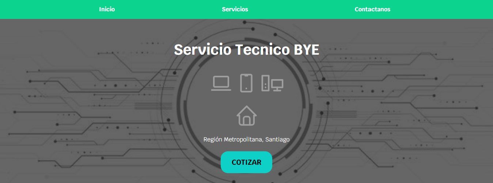
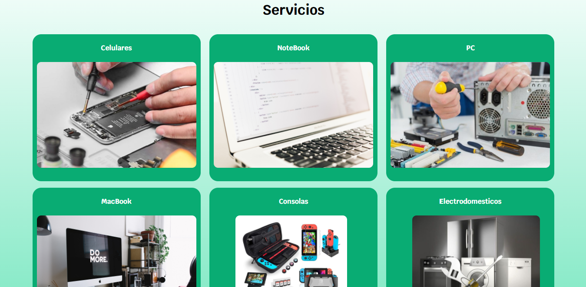
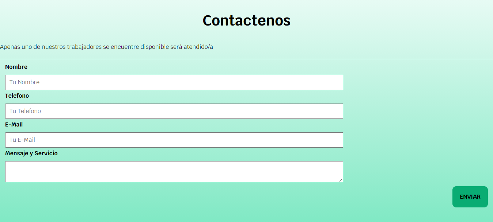
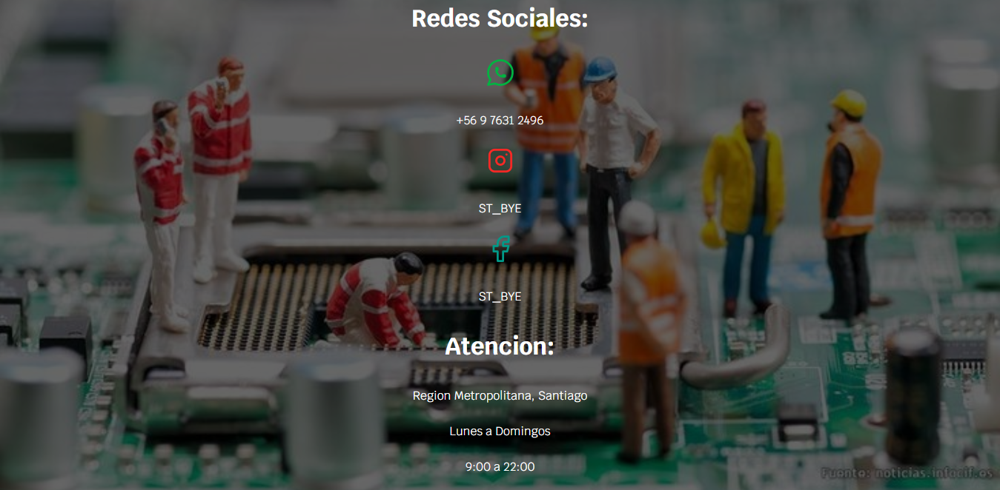

# ServicioTecnico
Pagina web compuesta por html y css, en la cual al inicio se encuantra una barra de navegacion con un fondo y nombre de la empresa luego se describe a la empresa su forma de trabajo junto con sus servicios, mas abajo un pequeño formulario para contactarlos, al final un footer con algunos datos.
 
 
En la siguiente pagina se encuentran los productos a los cuales la empresa ofrece servicio, cada producto lleva a su respectiva pagina donde se encuentran los servicios existentes en la empresa para el producto.
 
 
Luego en la ultima pagina se encuentra un Contact Us o formulario para que los puedan contactar.

# Imagenes Demostración
***Index***

***Servicios***

***Formulario***

***Footer***

# Visitar Sitio
Te dejo el link de la pagina por si la quieres revisar:
 
**https://serviciotecnicobye.netlify.app**

# Agradecimiento
Gracias a **Juan Pablo De La Torre Valdez** pude hacer esta pagina web por mi cuenta, aprendí viendo su curso de desarrollo web en Udemy.
 
Seguiré haciendo paginas web y tratando de que sean mucho mejor que ésta.